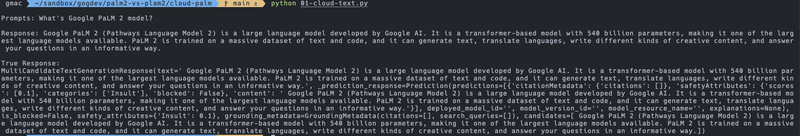
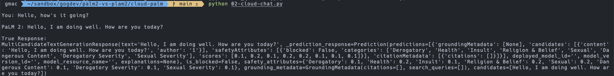
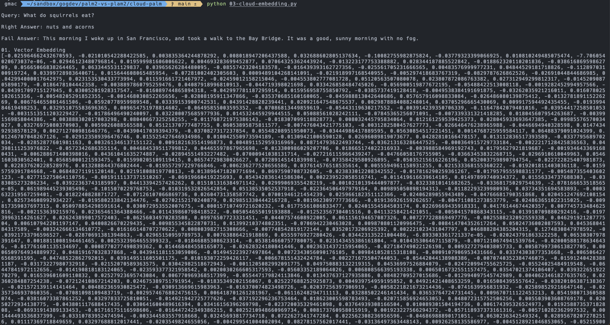

# PaLM 2 on Google Cloud
## Features 
PaLM 2 API on Google Cloud is suitable for enterprise customers!  
This API support English and also Korean, and many languages.  
And provides various versions compared to Developer.

## 01-cloud-text.py

## 02-cloud-chat.py

## 03-cloud-embedding.py
